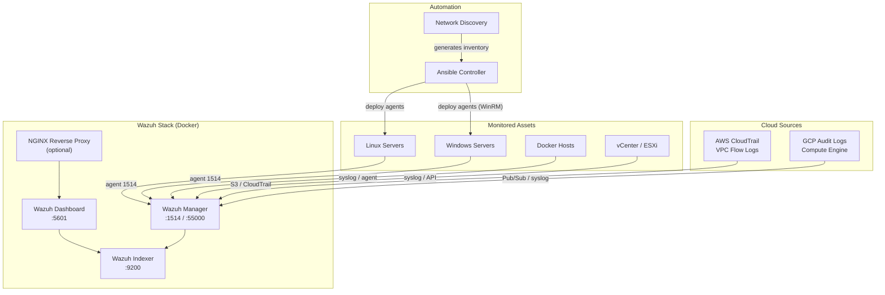

# Wazuh Docker Monitoring Platform

A production-ready, dockerized Wazuh deployment with Ansible automation, custom detection rules for Docker/VMware/AWS/GCP, and enterprise network discovery.

---

## Architecture



## Prerequisites

| Component | Version |
|-----------|---------|
| Docker    | 24.0+   |
| Docker Compose | v2+ |
| Ansible   | 2.15+   |
| Python    | 3.10+   |
| nmap      | 7.90+ (for discovery) |

For detailed requirements including permissions, firewall rules, user setup, and target host preparation, see **[docs/prerequisites.md](docs/prerequisites.md)**.

## Quick Start

### 1. Clone and configure

```bash
git clone https://github.com/YOUR_USER/wazuh-docker-monitoring-platform.git
cd wazuh-docker-monitoring-platform

# Run pre-flight checks (validates Docker, kernel params, ports, disk...)
make preflight

cp .env.example .env
# Edit .env — set all CHANGE_ME passwords
```

### 1b. Prepare target hosts

```bash
# Linux targets (run on each host, or distribute via SSH)
sudo bash scripts/utils/setup-target-linux.sh --ansible-user deploy --manager-ip 10.0.1.10

# Windows targets (run as Administrator on each host)
.\scripts\utils\setup-target-windows.ps1 -ManagerIP 10.0.1.10
```

### 2. Generate TLS certificates

```bash
bash scripts/utils/generate-certs.sh
```

### 3. Deploy Wazuh

```bash
# Core stack
docker compose up -d

# With NGINX reverse proxy
docker compose --profile with-nginx up -d

# Lab mode (reduced resources)
docker compose -f docker-compose.yml -f docker-compose.lab.yml up -d
```

### 4. Verify

```bash
# All containers healthy
docker compose ps

# Dashboard available
curl -sk https://localhost:5601
```

Dashboard: `https://localhost:5601`
API: `https://localhost:55000`

### 5. Deploy agents with Ansible

```bash
cd ansible

# Edit inventory
vim inventories/production/hosts.yml

# Deploy Linux agents
ansible-playbook -i inventories/production playbooks/deploy-linux-agent.yml

# Deploy Windows agents
ansible-playbook -i inventories/production playbooks/deploy-windows-agent.yml
```

## Custom Rules & Templates

Pre-built detection rules are in `rules/`:

| Directory     | Coverage |
|---------------|----------|
| `rules/linux/`   | SSH brute force, privilege escalation, persistence (cron/systemd/LD_PRELOAD/SSH keys), suspicious processes, credential access, kernel modules, user/group changes, auditd integration |
| `rules/docker/`  | Container lifecycle, exec events, privileged containers, suspicious mounts, port exposure, host namespace abuse, capabilities, crypto-mining, daemon config, network/volume ops |
| `rules/vmware/`  | VM power state, snapshots, host disconnect, alarms, vMotion, vCenter auth brute force |
| `rules/aws/`     | CloudTrail anomalies, IAM changes, security group to 0.0.0.0/0, EC2 lifecycle, console login without MFA |
| `rules/gcp/`     | Audit log events, firewall changes, compute instance lifecycle, IAM policy changes, public bucket detection |

The `rules/linux/` directory also includes `auditd_recommended.rules` — a ready-to-deploy auditd configuration that feeds security events to Wazuh.

### Import rules

Rules are automatically mounted into the Wazuh Manager container via `docker-compose.yml` volume bindings. After modifying rules:

```bash
docker exec wazuh-manager /var/ossec/bin/wazuh-control restart
```

## Network Discovery

Run enterprise-safe asset discovery to generate Ansible inventory:

```bash
cd scripts/discovery
python3 network_discovery.py --subnet 10.0.0.0/24 --output json
```

See [docs/agent-onboarding.md](docs/agent-onboarding.md) for the full onboarding pipeline: discovery → inventory → agent deploy → verification → tagging.

## Cloud Integration

### AWS

1. Configure CloudTrail to send logs to an S3 bucket.
2. Add AWS credentials to the Wazuh Manager configuration (see `examples/cloud-configs/aws-cloudtrail.xml`).
3. Custom rules in `rules/aws/` will fire on IAM changes, security group edits, and unauthorized API calls.

### GCP

1. Export audit logs to a Pub/Sub topic or forward via syslog.
2. Configure the Wazuh Manager syslog collector or use the GCP module (see `examples/cloud-configs/gcp-pubsub.xml`).
3. Custom rules in `rules/gcp/` detect firewall changes, instance creation, and IAM modifications.

For detailed cloud and VMware setup, see **[docs/integrations.md](docs/integrations.md)**.

## Documentation

| Document | Content |
|----------|---------|
| [docs/prerequisites.md](docs/prerequisites.md) | System requirements, permissions, firewall rules, user setup |
| [docs/deployment.md](docs/deployment.md) | Step-by-step deployment and hardening |
| [docs/agent-onboarding.md](docs/agent-onboarding.md) | Agent deployment, groups, verification |
| [docs/integrations.md](docs/integrations.md) | Docker, VMware, AWS, GCP integration details |
| [docs/operations.md](docs/operations.md) | Day-2 ops: backup/restore, upgrades, alerting, retention, troubleshooting |
| [docs/architecture.md](docs/architecture.md) | Component diagram, data flow, security model |

## Project Structure

```
├── ansible/                 # Agent deployment automation
│   ├── inventories/         # Production & lab inventories
│   ├── group_vars/          # Shared variables
│   ├── roles/               # Reusable Ansible roles
│   └── playbooks/           # Deployment playbooks
├── docker/                  # Container configurations
│   ├── wazuh/               # Wazuh config & certs
│   ├── nginx/               # Reverse proxy config
│   └── traefik/             # Alternative reverse proxy
├── rules/                   # Custom Wazuh rules
│   ├── linux/               # Linux security + auditd rules
│   ├── docker/              # Docker event detection (basic + advanced)
│   ├── vmware/              # vCenter/ESXi monitoring
│   ├── aws/                 # AWS CloudTrail rules
│   └── gcp/                 # GCP audit log rules
├── scripts/                 # Operational scripts
│   ├── discovery/           # Network discovery
│   ├── onboarding/          # Automated agent onboarding
│   └── utils/               # Certs, backup, healthcheck, vCenter export
├── docs/                    # Documentation
├── examples/                # Config examples + dashboard NDJSON
├── .github/workflows/       # CI/CD
├── docker-compose.yml       # Main deployment manifest
├── docker-compose.lab.yml   # Lab/demo resource overrides
├── Makefile                 # Single entry point for all operations
└── .env.example             # Environment template
```

## Makefile Commands

Run `make help` for the full list. Key commands:

```bash
make init              # First-time setup (env + certs)
make deploy            # Deploy Wazuh stack
make status            # Health check all components
make deploy-agents-linux   # Deploy agents via Ansible
make discover SUBNET=10.0.0.0/24  # Network discovery
make onboard SUBNET=10.0.0.0/24   # Full onboarding pipeline
make backup            # Backup Wazuh data
make reload-rules      # Reload custom rules
make lint              # Run all linters
```

## Troubleshooting

| Symptom | Check |
|---------|-------|
| Indexer won't start | `vm.max_map_count` must be ≥ 262144: `sysctl -w vm.max_map_count=262144` |
| Dashboard shows "no data" | Verify manager → indexer connectivity: `docker logs wazuh-manager` |
| Agent can't connect | Confirm port 1514/TCP is reachable and certificates match |
| High memory usage | Reduce `INDEXER_HEAP` in `.env` or scale indexer resources |
| Certificate errors | Regenerate with `scripts/utils/generate-certs.sh` |

## Teardown

```bash
# Stop and remove containers
docker compose down

# Remove containers AND persistent data
docker compose down -v
```

## Roadmap

- [ ] Wazuh cluster mode (multi-node manager)
- [ ] Kubernetes Helm chart
- [ ] SOAR integration (Shuffle / TheHive)
- [ ] Sigma rule auto-import
- [ ] Automated compliance dashboards (PCI-DSS, CIS)
- [ ] Slack/Teams alerting integration
- [ ] Terraform modules for cloud infrastructure

## License

MIT License — see [LICENSE](LICENSE).
