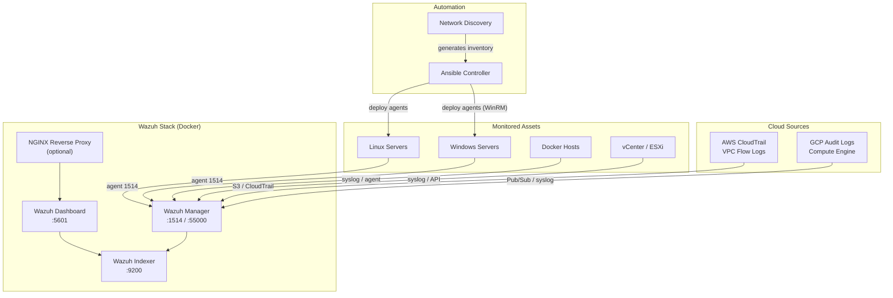

# wazuh-docker-monitoring-platform

> **Production-ready Wazuh SIEM on Docker** — with Ansible agent deployment, custom detection rules for Linux/Docker/VMware/AWS/GCP, and automated network discovery. Spin up enterprise-grade security monitoring in minutes.

[](LICENSE)
[](https://wazuh.com)
[](https://docs.docker.com/compose/)
[](https://ansible.com)

---

## Why this project?

Setting up Wazuh for real infrastructure — not just a demo — means writing detection rules, connecting cloud sources, automating agent rollout, and surviving Day 2 operations. This project bundles everything you'd otherwise spend weeks assembling:

- **Custom rules** tuned for Docker, VMware vCenter, AWS CloudTrail, and GCP Audit Logs — not just generic Linux alerts
- **Ansible automation** to deploy and manage agents at scale (Linux + Windows)
- **Automated network discovery** — scan a subnet, generate an inventory, onboard agents in one pipeline
- **Lab mode** for testing on low-resource machines, production mode for real deployments
- Full **docs, Makefile, and CI** included

---

## Architecture



---

## Prerequisites

| Component | Version |
|-----------|---------|
| Docker | 24.0+ |
| Docker Compose | v2+ |
| Ansible | 2.15+ |
| Python | 3.10+ |
| nmap | 7.90+ (for discovery) |

For detailed requirements including permissions, firewall rules, user setup, and target host preparation, see **[docs/prerequisites.md](docs/prerequisites.md)**.

---

## Quick Start

### 1. Clone and configure

```bash
git clone https://github.com/GiulioSavini/wazuh-docker-monitoring-platform.git
cd wazuh-docker-monitoring-platform

# Run pre-flight checks (validates Docker, kernel params, ports, disk...)
make preflight

cp .env.example .env
# Edit .env — set all CHANGE_ME passwords
```

### 1b. Prepare target hosts

```bash
# Linux targets
sudo bash scripts/utils/setup-target-linux.sh --ansible-user deploy --manager-ip 10.0.1.10

# Windows targets (run as Administrator)
.\scripts\utils\setup-target-windows.ps1 -ManagerIP 10.0.1.10
```

### 2. Generate TLS certificates

```bash
bash scripts/utils/generate-certs.sh
```

### 3. Deploy Wazuh

```bash
# Production
docker compose up -d

# With NGINX reverse proxy
docker compose --profile with-nginx up -d

# Lab mode (reduced resources)
docker compose -f docker-compose.yml -f docker-compose.lab.yml up -d
```

### 4. Verify

```bash
docker compose ps
curl -sk https://localhost:5601
```

- Dashboard: `https://localhost:5601`
- API: `https://localhost:55000`

### 5. Deploy agents with Ansible

```bash
cd ansible
vim inventories/production/hosts.yml

ansible-playbook -i inventories/production playbooks/deploy-linux-agent.yml
ansible-playbook -i inventories/production playbooks/deploy-windows-agent.yml
```

---

## Custom Detection Rules

Pre-built rules are in `rules/` and mounted automatically into the Wazuh Manager container.

| Directory | Coverage |
|-----------|----------|
| `rules/linux/` | SSH brute force, privilege escalation, persistence (cron/systemd/LD_PRELOAD/SSH keys), suspicious processes, credential access, kernel modules, user/group changes, auditd integration |
| `rules/docker/` | Container lifecycle, exec events, privileged containers, suspicious mounts, port exposure, host namespace abuse, capabilities, crypto-mining, daemon config, network/volume ops |
| `rules/vmware/` | VM power state, snapshots, host disconnect, alarms, vMotion, vCenter auth brute force |
| `rules/aws/` | CloudTrail anomalies, IAM changes, security group to 0.0.0.0/0, EC2 lifecycle, console login without MFA |
| `rules/gcp/` | Audit log events, firewall changes, compute instance lifecycle, IAM policy changes, public bucket detection |

`rules/linux/` also includes `auditd_recommended.rules` — a ready-to-deploy auditd config that feeds security events directly to Wazuh.

After modifying rules:

```bash
docker exec wazuh-manager /var/ossec/bin/wazuh-control restart
# or
make reload-rules
```

---

## Network Discovery & Agent Onboarding

```bash
# Scan subnet and generate Ansible inventory
cd scripts/discovery
python3 network_discovery.py --subnet 10.0.0.0/24 --output json

# Full pipeline: discover → inventory → deploy → verify
make onboard SUBNET=10.0.0.0/24
```

See [docs/agent-onboarding.md](docs/agent-onboarding.md) for the complete onboarding guide.

---

## Cloud Integration

### AWS

1. Configure CloudTrail to send logs to an S3 bucket.
2. Add AWS credentials to the Wazuh Manager config (`examples/cloud-configs/aws-cloudtrail.xml`).
3. Rules in `rules/aws/` fire on IAM changes, security group edits, and unauthorized API calls.

### GCP

1. Export audit logs to a Pub/Sub topic or forward via syslog.
2. Configure the Wazuh Manager syslog collector (`examples/cloud-configs/gcp-pubsub.xml`).
3. Rules in `rules/gcp/` detect firewall changes, instance creation, and IAM modifications.

For VMware setup, see **[docs/integrations.md](docs/integrations.md)**.

---

## Makefile Commands

```bash
make init                          # First-time setup (env + certs)
make deploy                        # Deploy Wazuh stack
make status                        # Health check all components
make deploy-agents-linux           # Deploy agents via Ansible
make discover SUBNET=10.0.0.0/24  # Network discovery
make onboard SUBNET=10.0.0.0/24   # Full onboarding pipeline
make backup                        # Backup Wazuh data
make reload-rules                  # Reload custom rules
make lint                          # Run all linters
```

Run `make help` for the full list.

---

## Troubleshooting

| Symptom | Fix |
|---------|-----|
| Indexer won't start | `sysctl -w vm.max_map_count=262144` |
| Dashboard shows "no data" | `docker logs wazuh-manager` — check manager → indexer connectivity |
| Agent can't connect | Confirm port 1514/TCP is open and certs match |
| High memory usage | Reduce `INDEXER_HEAP` in `.env` |
| Certificate errors | `bash scripts/utils/generate-certs.sh` |

---

## Documentation

| Document | Content |
|----------|---------|
| [docs/prerequisites.md](docs/prerequisites.md) | System requirements, permissions, firewall rules |
| [docs/deployment.md](docs/deployment.md) | Step-by-step deployment and hardening |
| [docs/agent-onboarding.md](docs/agent-onboarding.md) | Agent deployment, groups, verification |
| [docs/integrations.md](docs/integrations.md) | Docker, VMware, AWS, GCP integration details |
| [docs/operations.md](docs/operations.md) | Backup/restore, upgrades, alerting, retention |
| [docs/architecture.md](docs/architecture.md) | Component diagram, data flow, security model |

---

## Project Structure

```
├── ansible/                 # Agent deployment automation
│   ├── inventories/
│   ├── group_vars/
│   ├── roles/
│   └── playbooks/
├── docker/                  # Container configurations
│   ├── wazuh/
│   ├── nginx/
│   └── traefik/
├── rules/                   # Custom Wazuh detection rules
│   ├── linux/
│   ├── docker/
│   ├── vmware/
│   ├── aws/
│   └── gcp/
├── scripts/
│   ├── discovery/           # Network discovery
│   ├── onboarding/          # Automated agent onboarding
│   └── utils/               # Certs, backup, healthcheck
├── docs/
├── examples/                # Config examples + dashboard NDJSON
├── .github/workflows/
├── docker-compose.yml
├── docker-compose.lab.yml
├── Makefile
└── .env.example
```

---

## Roadmap

- [ ] Wazuh cluster mode (multi-node manager)
- [ ] Kubernetes Helm chart
- [ ] SOAR integration (Shuffle / TheHive)
- [ ] Sigma rule auto-import
- [ ] Automated compliance dashboards (PCI-DSS, CIS)
- [ ] Slack/Teams alerting integration
- [ ] Terraform modules for cloud infrastructure

---

## License

MIT — see [LICENSE](LICENSE)

## Author

[GiulioSavini](https://github.com/GiulioSavini)
